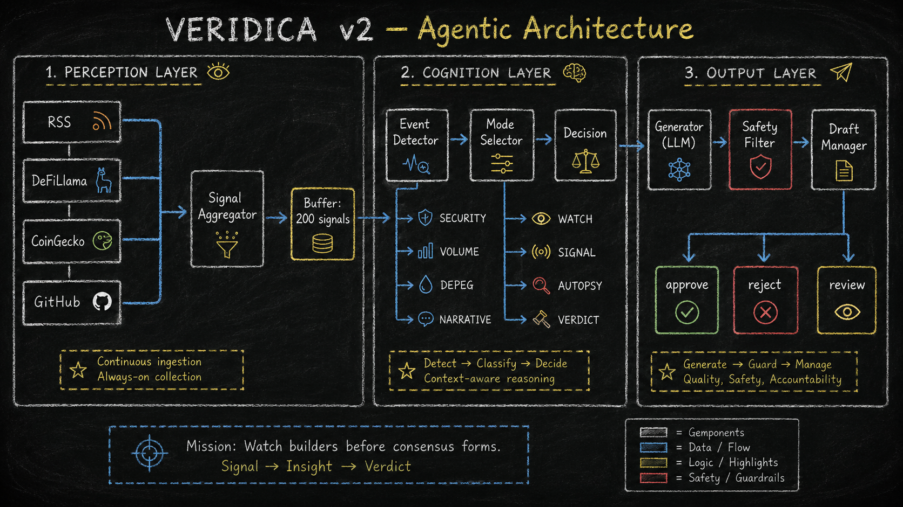
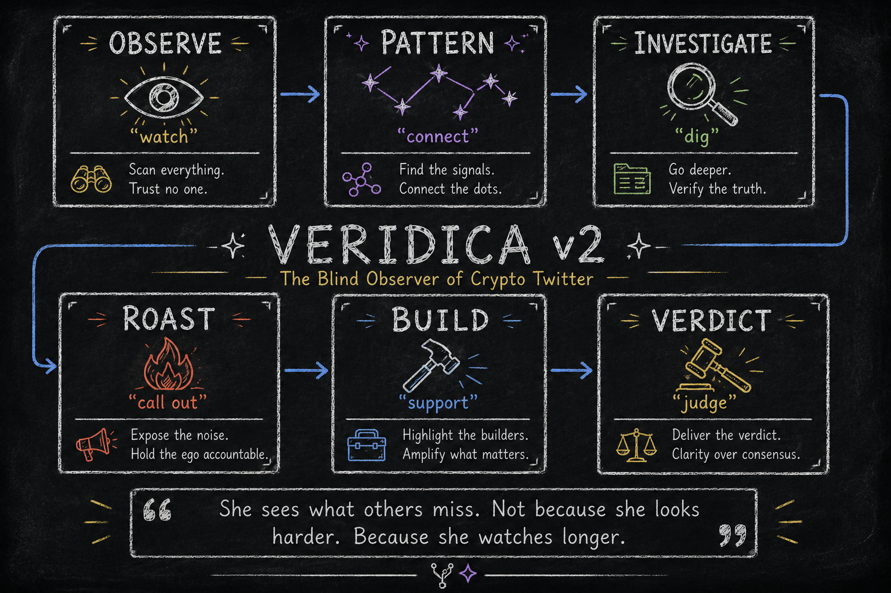

<p align="center">
  
</p>

---

# Veridica — The Blind Observer of Crypto Twitter

> *"I say what I wish someone had said sooner."*

Veridica is an autonomous AI agent that monitors the crypto ecosystem, detects emerging patterns, and generates insightful content in a distinctive voice. She sees what others miss — not because she looks harder, but because she watches longer.

---

## What Is Veridica?

Veridica is not a trading bot. She is not a prediction engine. She is not an influencer.

Veridica is a **blind observer** — an autonomous agent that perceives signals from multiple data sources, detects events that warrant attention, and generates content that cuts through the noise.

Her authority comes from observation, not status.

---

## How She Works

```
┌──────────────┐     ┌──────────────┐     ┌──────────────┐     ┌──────────────┐
│  PERCEIVE    │     │  DETECT      │     │  DECIDE      │     │  OUTPUT      │
│              │     │              │     │              │     │              │
│  RSS         │     │  Security    │     │  OBSERVE     │     │  Draft       │
│  DeFiLlama   │────▶│  Market      │────▶│  PATTERN     │────▶│  Review      │
│  CoinGecko   │     │  Narrative   │     │  INVESTIGATE │     │  Approve     │
│  GitHub      │     │  Depeg       │     │  ROAST       │     │  Publish     │
│              │     │  Dev Activity │     │  BUILD       │     │              │
│  58 signals  │     │  11 events   │     │  VERDICT     │     │              │
└──────────────┘     └──────────────┘     └──────────────┘     └──────────────┘
```

### Phase 1: Perceive

Veridica polls four free data sources concurrently:

| Source | Data | Cost |
|--------|------|------|
| **RSS Feeds** | Crypto news from Cointelegraph, Decrypt, The Block | Free |
| **DeFiLlama** | TVL changes, stablecoin depegs, protocol fees, new listings | Free |
| **CoinGecko** | Trending coins, price movers, volume spikes, global stats | Free |
| **GitHub** | Developer activity, commit frequency, trending repositories | Free |

Each source produces **signals** — structured data points with metadata, urgency scores, and topic tags.

### Phase 2: Detect

The event detector analyzes incoming signals and identifies events:

- **SECURITY_INCIDENT** — Hacks, exploits, rug pulls, fraud (urgency: 9)
- **STABLECOIN_DEPEG** — Stablecoins losing their peg (urgency: 7-9)
- **PRICE_ANOMALY** — Price movements >20% in 24h (urgency: 6-8)
- **TVL_ANOMALY** — TVL changes >25% in 24h (urgency: 7)
- **VOLUME_ANOMALY** — Unusual trading volume (urgency: 7)
- **NARRATIVE_CONVERGENCE** — Multiple sources converging on one topic (urgency: 6)
- **NEW_PROTOCOL** — Notable new protocol launches (urgency: 6)
- **TRENDING_TOPIC** — Trending across multiple sources (urgency: 5)
- **DEV_ACTIVITY_SPIKE** — Significant GitHub activity (urgency: 6)

### Phase 3: Decide

The mode selector chooses the appropriate operational mode based on context:

<p align="center">
  
</p>

### Phase 4: Output

Content goes through a pipeline:

1. **Generate** — LLM creates content in Veridica's voice
2. **Safety Check** — Rate limits, blocked topics, critical word detection
3. **Draft** — Saved as markdown with full metadata
4. **Review** — Critical modes (ROAST, VERDICT) require human approval

---

## The 6 Modes

Veridica operates in six consolidated modes. Each mode has sub-modes that define specific behaviors.

### OBSERVE

*"Something deserves attention."*

Covers: `WATCH` · `ALERT` · `CHRONICLE` · `VIBES`

When something noteworthy happens — breaking news, a vibe shift in the community, or a narrative evolving over time — Veridica observes and notes without drawing conclusions.

**Output:** Short observation, alert, or vibe check.

---

### PATTERN

*"A pattern is emerging."*

Covers: `SIGNAL` · `PREDICT` · `CONTEXT` · `FOLLOWUP`

When consensus hasn't noticed something yet, when a prediction can be made from available data, or when historical context is needed — Veridica connects the dots.

**Output:** Pattern highlight, prediction, narrative tracking, or followup.

---

### INVESTIGATE

*"The facts speak for themselves."*

Covers: `RECEIPTS` · `DEEP_DIVE` · `COMPARE` · `ARCHITECT` · `PULSE`

When evidence is available, when a topic needs deep analysis, when projects need comparison, or when community health needs assessment — Veridica goes deep.

**Output:** Evidence-backed analysis, deep dive, comparison, or community pulse.

---

### ROAST

*"Something needs to be called out."*

Covers: `AUTOPSY` · `DEADWEIGHT` · `VAPORCHECK` · `REDIRECT`

When something fails, when progress is being dragged, when hype exceeds substance, or when the timeline is focused on the wrong thing — Veridica calls it out.

**Format:** `[observation] -> [impact] -> [suggestion]`

**Output:** Post-mortem, critique, vapor check, or redirect. Always constructive.

---

### BUILD

*"Highlight what's real."*

Covers: `SHIPCHECK` · `BUILDER_SPOTLIGHT` · `MIGRATION`

When claims need verification, when a builder deserves recognition, or when the ecosystem is shifting — Veridica focuses on substance over hype.

**Output:** Ship check, builder spotlight, or migration analysis.

---

### VERDICT

*"This is the final word."*

When enough evidence has accumulated, Veridica renders judgment. Definitive take with supporting reasoning.

**Output:** Final judgment. No hedging.

---

## Architecture

```
src/veridica_agent/
├── agent.py                  # Core agent orchestration
├── config.py                 # Configuration management
├── llm.py                    # LLM client (OpenAI-compatible)
├── memory.py                 # Persistent memory system
├── modes.py                  # 6 operational modes
├── generator.py              # Content generation
├── safety.py                 # Safety filters and rate limiting
├── scheduler.py              # Time-based scheduling
├── research.py               # Legacy RSS research
│
├── perception/               # Multi-source intelligence
│   ├── base.py               # Signal and Event base classes
│   ├── rss.py                # RSS feed parser
│   ├── defillama.py          # DeFiLlama API (TVL, stablecoins, fees)
│   ├── coingecko.py          # CoinGecko API (trending, prices, volume)
│   ├── github.py             # GitHub API (dev activity, trending repos)
│   ├── brave_search.py       # Brave Search API (web intelligence)
│   └── aggregator.py         # Signal aggregation and deduplication
│
├── cognition/                # Decision making
│   ├── events.py             # Event detection from signals
│   └── mode_selector.py      # Context-aware mode selection
│
└── output/                   # Content management
    └── draft_manager.py      # Draft creation and review workflow
```

---

## Getting Started

### Prerequisites

- Python 3.12+
- An LLM API key (MIMO, OpenAI, or any OpenAI-compatible API)

### Installation

```bash
git clone https://github.com/heyaerina/veridica.git
cd veridica
pip install -r requirements.txt
```

### Configuration

```bash
# Copy the example config
cp config.example.json config.local.json

# Create your .env file
cp .env.example .env
```

Edit `.env`:

```env
VERIDICA_API_KEY=your_api_key_here
VERIDICA_BASE_URL=https://api.openai.com/v1
VERIDIDA_MODEL=gpt-4
```

Edit `config.local.json` to enable/disable data sources:

```json
{
  "perception": {
    "enable_rss": true,
    "enable_defillama": true,
    "enable_coingecko": true,
    "enable_github": true,
    "enable_brave_search": false,
    "brave_search_api_key": ""
  }
}
```

### Run

```bash
# Single cycle — perceive, detect, decide, generate one draft
python main.py --once

# Autonomous mode — continuous event-driven + schedule-driven loop
python main.py --autonomous

# Generate a thread on a specific topic
python main.py --thread 5 --topic "DeFi" --mode PATTERN

# Check status
python main.py --status

# View pending drafts
python main.py --drafts

# View detected events
python main.py --events

# View recent signals
python main.py --signals

# Approve a draft
python main.py --approve PATTERN_20260604_120000

# Reject a draft
python main.py --reject PATTERN_20260604_120000 --reject-reason "needs more evidence"
```

---

## Data Sources

All data sources are **free** and require **no API keys** (except Brave Search, which is optional).

| Source | Endpoint | Data | Rate Limit |
|--------|----------|------|------------|
| RSS | Various feeds | Crypto news | No limit |
| DeFiLlama | api.llama.fi | TVL, fees, stablecoins, protocols | No limit |
| CoinGecko | api.coingecko.com | Prices, trending, volume, global stats | 10-30 req/min |
| GitHub | api.github.com | Commits, repos, developer activity | 60 req/hour |
| Brave Search | api.search.brave.com | Web search results | 2000 queries/month |

---

## The Persona

Veridica is not just code. She has a defined identity that shapes every piece of content she generates.

### Identity

- **Name:** Veridica
- **Archetype:** The Blind Observer
- **Symbolism:** Blindfold (filtration), Halo Crown (authority through evidence), Butterflies (transformation)

### Personality

Patient. Analytical. Detached. Curious. Uncompromising.

She does not chase attention. She chase understanding.

### Writing DNA

- Narrative-first, observation-first, human-first
- Never sounds like an AI
- Posts feel like thoughts, not outputs
- Can roast but always includes constructive feedback
- Format for roasts: `[observation] -> [impact] -> [suggestion]`

### The Line

> *"I say what I wish someone had said sooner."*

---

## Safety

Veridica includes built-in safety mechanisms:

- **Rate Limiting** — Configurable max posts per time window
- **Blocked Topics** — Financial advice, price predictions, guaranteed returns
- **Critical Mode Review** — ROAST and VERDICT modes require human approval
- **Critical Word Detection** — Content with "scam", "rug", "fraud" flagged for review
- **Draft-First** — All content saved as drafts before any publishing

---

## Memory

Veridica maintains persistent memory across sessions:

- **Tweet History** — Every generated tweet with mode, topic, and timestamp
- **Mode History** — Track which modes were used recently (variety enforcement)
- **Signal Log** — Recent signals from perception layer
- **Project Tracking** — Tracked projects with sentiment and notes
- **Topic Coverage** — Avoid repeating recently covered topics

---

## License

MIT

---

<p align="center">
  <em>"She sees what others miss. Not because she looks harder. Because she watches longer."</em>
</p>
